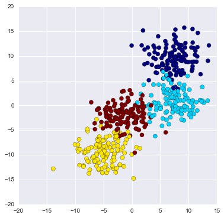
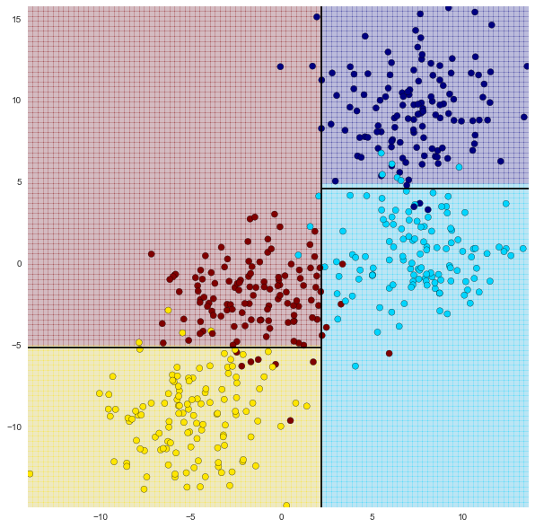
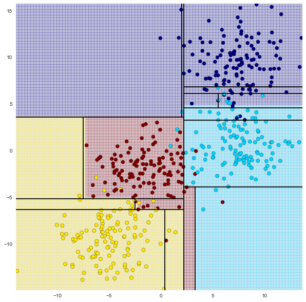
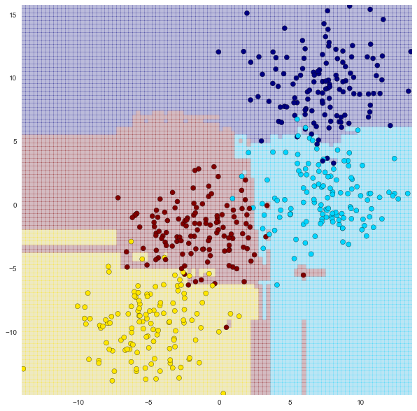
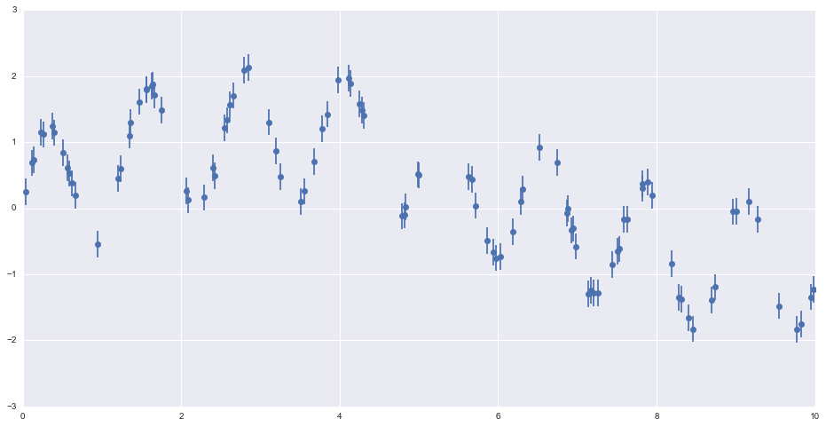
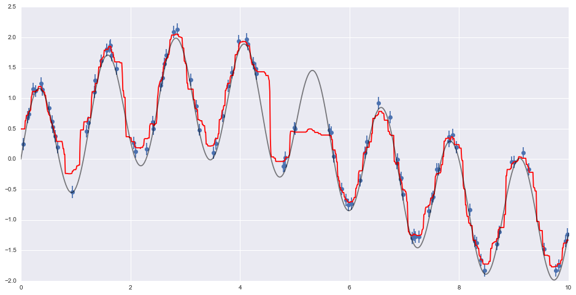

## Decision Trees and Random Forests


```python
import numpy as np
import pandas as pd
import matplotlib.pyplot as plt
%matplotlib inline
import seaborn
```


```python
#Let's make our own dataset using sklearn.datasets.make_blobs
#make_blobs generates Gaussian blobs for clustering
from sklearn.datasets import make_blobs

X,y = make_blobs(n_samples = 500, n_features=2, centers=4, random_state=8, cluster_std=2.4)

plt.figure(figsize=(6,6))
plt.scatter(X[:,0], X[:,1], c=y, s=50, cmap='jet')
```


    <matplotlib.collections.PathCollection at 0x2c0676b0208>





```python
from sklearn.tree import DecisionTreeClassifier
```

### Visualization function


```python
def visualize_tree(classifier, X, y, boundaries=True,xlim=None, ylim=None):
    '''
    Visualizes a Decision Tree. 
    INPUTS: Classifier Model, X, y, optional x/y limits.
    OUTPUTS: Meshgrid visualization for boundaries of the Decision Tree
    '''
     
    # Fit the X and y data to the tree
    classifier.fit(X, y)

    
    # Automatically set the x and y limits to the data (+/- 0.1)
    if xlim is None:
        xlim = (X[:, 0].min() - 0.1, X[:, 0].max() + 0.1)
    if ylim is None:
        ylim = (X[:, 1].min() - 0.1, X[:, 1].max() + 0.1)

    # Assign the variables
    x_min, x_max = xlim
    y_min, y_max = ylim
    
    
    # Create a mesh grid
    xx, yy = np.meshgrid(np.linspace(x_min, x_max, 100),
                         np.linspace(y_min, y_max, 100))
    
    # Define the Z by the predictions (this will color in the mesh grid)
    Z = classifier.predict(np.c_[xx.ravel(), yy.ravel()])

    # Reshape based on meshgrid
    Z = Z.reshape(xx.shape)
    
    # Plot the figure (use)
    plt.figure(figsize=(10,10))
    plt.pcolormesh(xx, yy, Z, alpha=0.2, cmap='jet')
    

    # Plot also the training points
    plt.scatter(X[:, 0], X[:, 1], c=y, s=50, cmap='jet')
    
    #Set Limits
    plt.xlim(x_min, x_max)
    plt.ylim(y_min, y_max)        
    
    def plot_boundaries(i, xlim, ylim):
        '''
        Plots the Decision Boundaries
        '''
        if i < 0:
            return

        # Shorter variable name
        tree = classifier.tree_
        
        # Recursively go through nodes of tree to plot boundaries.
        if tree.feature[i] == 0:
            plt.plot([tree.threshold[i], tree.threshold[i]], ylim, '-k')
            plot_boundaries(tree.children_left[i],
                            [xlim[0], tree.threshold[i]], ylim)
            plot_boundaries(tree.children_right[i],
                            [tree.threshold[i], xlim[1]], ylim)
        
        elif tree.feature[i] == 1:
            plt.plot(xlim, [tree.threshold[i], tree.threshold[i]], '-k')
            plot_boundaries(tree.children_left[i], xlim,
                            [ylim[0], tree.threshold[i]])
            plot_boundaries(tree.children_right[i], xlim,
                            [tree.threshold[i], ylim[1]])
    
    # Random Forest vs Single Tree
    if boundaries:
        plot_boundaries(0, plt.xlim(), plt.ylim())
```


```python
#Set model variable
clf = DecisionTreeClassifier(max_depth=2, random_state=0)

#Show boundaries
visualize_tree(clf,X,y)
```





The figure above is obtained using a maximum depth of 2. 

How about if we go 4 levels deep?


```python
clf = DecisionTreeClassifier(max_depth=4, random_state=0)

visualize_tree(clf,X,y)
```





Increasing the depth, we see evidence of over-fitting. This means that if we were to predict a new point, the result would be influenced more by noise than the signal.

To address the over-fitting problem, we create an ensemble of decision trees

## Random Forests
Ensemble Methods essentially average the results of many individual estimators which over-fit the data. The resulting estimates are much more robust and accurate than the individual estimates which make them up! One of the most common ensemble methods is the Random Forest, in which the ensemble is made up of many decision trees which are in some way perturbed. We will use Sci-Kit Learn to create a random forest.

Note that n_estimators stands for the number of trees to use. Intuitively, we know that using more decision trees would be better, but after a certain amount of trees (somewhere between 100-400 depending on the data) the benefits in accuracy of adding more estimators significantly decreases and just becomes a load on the CPU.


```python
from sklearn.ensemble import RandomForestClassifier

clf = RandomForestClassifier(n_estimators=100, random_state=0)

visualize_tree(clf,X,y,boundaries=False)
```





## Random Forest Regression
Let's imagine we have some sort of weather data that is sinusoidal in nature with some noise. It has a slow oscillation component, a fast oscillation component, and then a random noise component.


```python
from sklearn.ensemble import RandomForestRegressor

x = 10*np.random.rand(100)
```


```python
def sin_model(x,sigma=0.2):
    '''
    Generate random sinusoidal data for regression analysis.
    '''
    noise = sigma*np.random.rand(len(x))
    return np.sin(5*x) + np.sin(0.5*x) + noise
```


```python
# call y for data with x
y = sin_model(x)

plt.figure(figsize=(16,8))
plt.errorbar(x,y,0.2,fmt='o')
```


    <Container object of 3 artists>





If we knew nothing about the thrue nature of the model, polynomial or sinusoidal regression would be tedious. With random forests regression, we can know very little about the true nature of the data and still fit a model to it


```python
from sklearn.ensemble import RandomForestRegressor

#X points
xfit = np.linspace(0,10,1000)

#Model
rfr = RandomForestRegressor(100) #first parameter is the number of estimators or number of trees
```


```python
# Fit Model (Format array x for y using [:,None])
rfr.fit(x[:,None],y)

# Set the predicted points
yfit = rfr.predict(xfit[:,None])

# Set the real points (the model function)
ytrue = sin_model(xfit,0) # sigma = 0 here, i.e., no noise
```


```python
#Plot
plt.figure(figsize=(16,8))

plt.errorbar(x,y,0.1, fmt='o')

plt.plot(xfit,yfit, '-r')

plt.plot(xfit,ytrue, '-k', alpha=0.5)
```


    [<matplotlib.lines.Line2D at 0x2c067aefe48>]





The non-parametric random forest model is flexible enough to fit the multi-period data, without us even specifying a multi-period model!

This is a tradeoff between simplicity and thinking about what your data actually is.


```python

```
